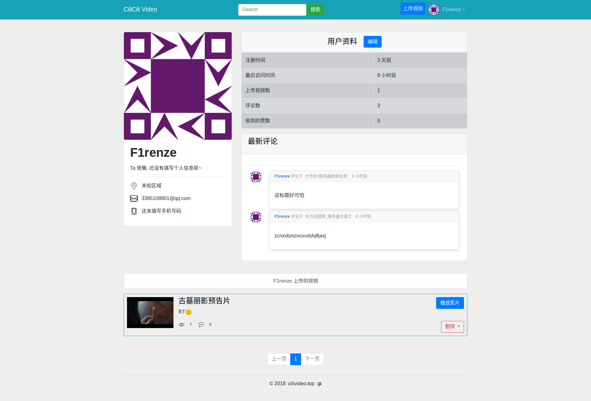
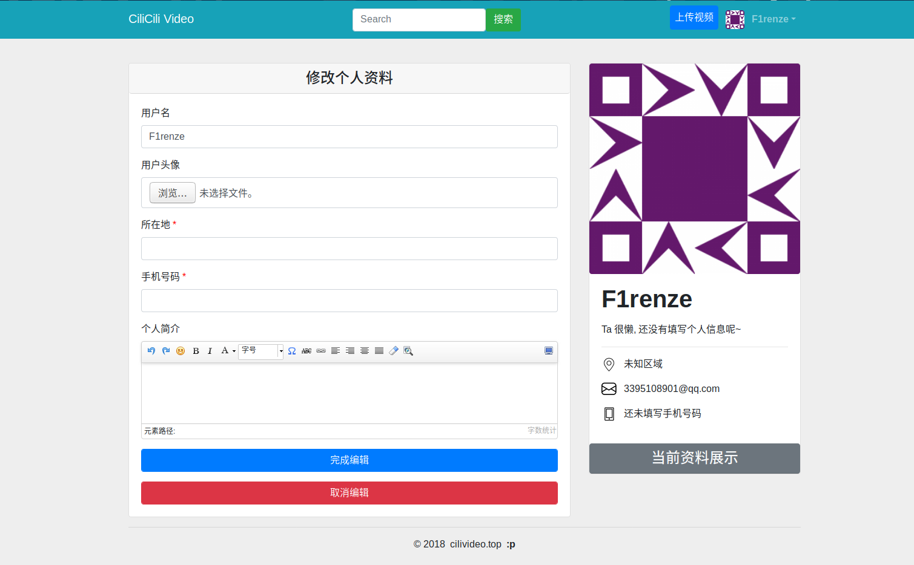
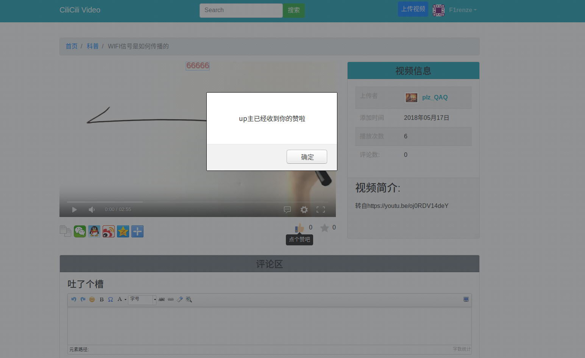
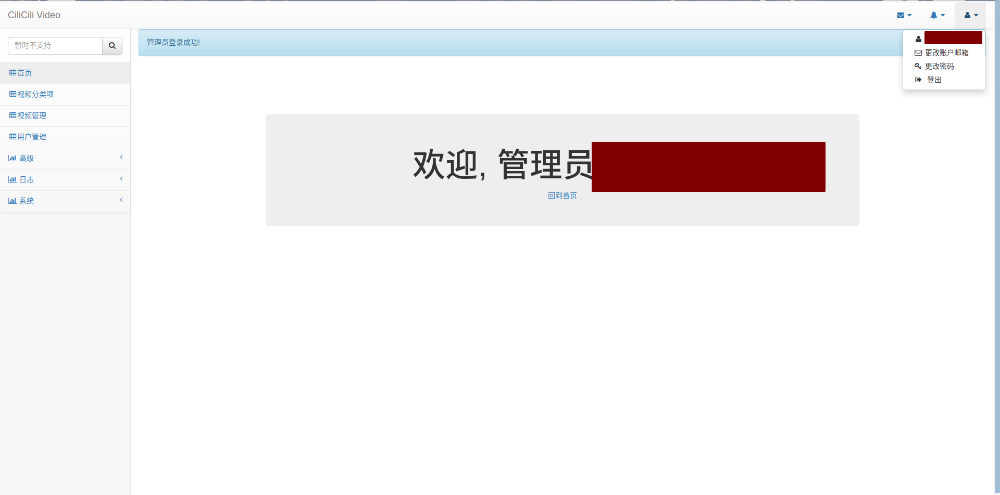

# CiliCili Video


---

Update: 2018.10.22

项目上线地址:  [http://www.cilivideo.top/](http://www.cilivideo.top/)(建议在 PC 上使用 火狐浏览器访问)

此项目是基于 Python / Flask 开发的小型视频网站, 使用 MySQL 作为存储数据库, Redis 提供缓存及弹幕队列支持, 使用开源的HTML5播放器 [DPlayer](https://github.com/MoePlayer/DPlayer) 作为播放器插件, 视频评论区使用了百度的 [UEditor](http://ueditor.baidu.com/website/) 作为编辑器, 视频上传界面使用 [ckeditor](https://ckeditor.com) 作为编辑器, 后台管理使用的是 [Flask-Admin](https://flask-admin.readthedocs.io/en/latest/).

## 主要功能
- [x] 注册/登录/登出, 重置密码, 更改邮箱, 更改密码
- [x] 一键初始化站点(添加管理员帐号, 添加视频分类)
- [x] 视频的上传, 删除, 评论/删除评论/屏蔽评论(管理员), 发送弹幕, 收藏及点赞, 支持搜索视频
- [x] 用户个人资料展示与编辑, 支持上传头像
- [x] 后台管理, 包括以下内容
  - 视频分类
  - 视频管理
  - 用户管理
  - 评论管理
  - 管理员账户
  - 用户日志(登录, 点赞, 删除视频)
  - 管理员日志(登录, 创建, 修改, 删除)
  - 静态文件管理

## ToDo

- [x] Docker 部署, 使用 Docker-compose 编排
- [x] 支持 Jenkins 实现 CD
- [ ] 邮件服务改为使用 SendGird Web API
- [ ] 单元测试 & CI
- [ ] 适应移动端
- [ ] 记录异常日志
- [ ] 后台监控服务器状态

## 部署
~~可参考我的部署记录文章: [文章地址](http://www.f1renze.top/2018/05/17/Flask-Gunicorn-Nginx-%E9%83%A8%E7%BD%B2%E8%AE%B0%E5%BD%95/)~~

### **手动部署**

- 设定环境变量

  ```shell
  APP_WEBC=production # 指定 App 使用何种配置
  APP_MH=database # App 使用的 Mysql Host, 此为 docker-compose service name
  APP_MDB=cili_db # App 使用的 DB, 与 SQL File 同步
  # DB Container default user root, pwd secret
  APP_MU=<You Like> # App 使用的 Mysql 用户
  APP_MP=<You Like> # App 使用的 Mysql 用户的密码
  APP_RH=redis # App 使用的 Redis Host, 此为 docker-compose service name
  # Recommended to use SendGrid
  APP_MAILS=<You Like> # 指定 Flask-Mail 邮件服务器
  APP_MAILU=<You Like> # 邮件服务器登录用户
  APP_MAILP=<You Like> # 邮件服务器登录密码
  APP_SENDER=<You Like> # App 发送邮件的发件人
  ```

- 构建镜像

  ```shell
  export <以上的环境变量>
  docker-compose -f zbuild/docker-compose.yml up -d --build
  ```

- 初始化并启动 Gunicorn

  ```shell
  $ docker exec -it f_app /bin/ash
  /var/www # mysql -h $MYSQL_HOST -u$MYSQL_USR -p$MYSQL_PWD < initial.sql
  /var/www # python manage.py initialize
  /var/www # mkdir logs && chmod 777 logs
  /var/www # gunicorn manage:app -c gunicorn.conf.py
  ```

- 退出所有容器

  ```shell
  docker-compose -f zbuild/docker-compose.yml down
  ```

### **自动部署**
占坑, 简单描述: 安装 Environment Injector 插件后添加上面的环境变量构建即可

### **排查异常**

- 查看 Docker 日志即可, 获取日志路径

  ```shell
  docker inspect f_app | grep log
  ```


## 图示

**首页**


**搜索**


**用户资料**


**资料编辑**


**视频播放**


**点赞与弹幕**


弹幕发送


**后台首页**


**视频管理**


**静态文件管理**


**日志记录**


**评论管理**


## 反馈
有任何问题欢迎提 Issue, 共同进步!